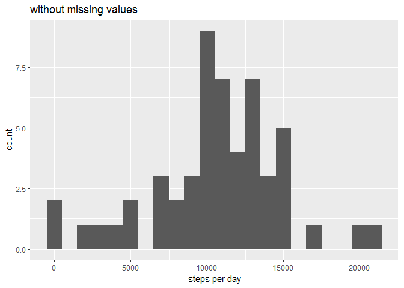
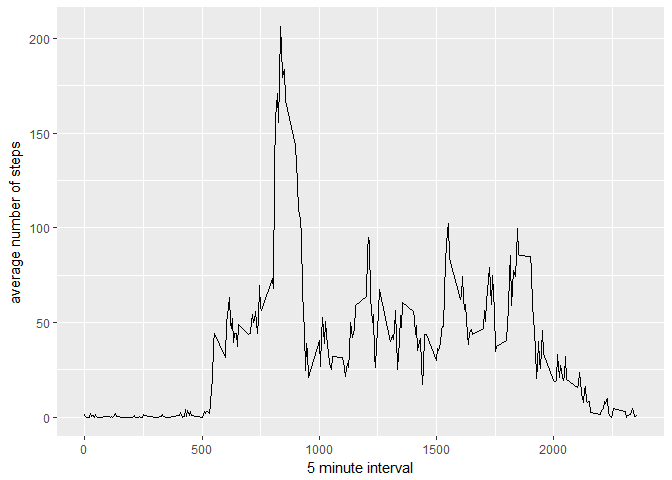
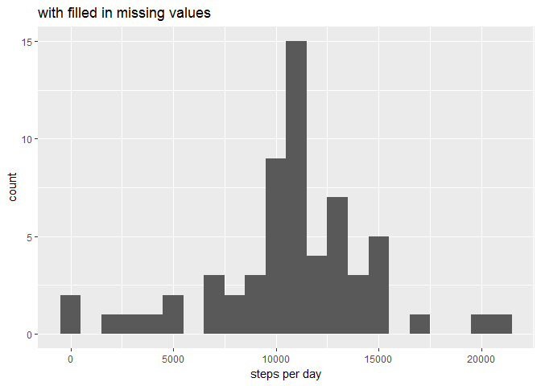
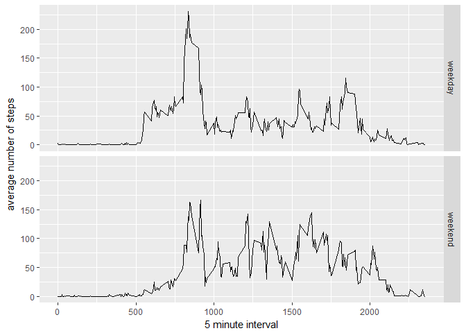

Please find below the first course project for the Reproducible Research course. First, load the ggplot2 library:


```r
library(ggplot2)
```

## Loading and preprocessing the data

If the activity.csv file does not exist, extract from the activity.zip file. Read the information in a data frame called `dat`:


```r
if (!file.exists("./activity.csv")) {
    unzip("./activity.zip")
}
dat <- read.csv("./activity.csv")
```

## What is mean total number of steps taken per day?

Since the missing values in the dataset are currently ignored, create a new variable `woNA`:


```r
woNA <- dat[!is.na(dat$steps),]
```

Using the `aggregate()` function, compute the total number of steps per day and use this variable to produce a histogram and compute its mean/median values


```r
sperd <- aggregate(woNA$steps, by=list(date=woNA$date), FUN=sum)
## histogram of total steps / day
qplot(data = sperd, x = x, xlab = "steps per day", binwidth=1000, main = "without missing values")
```

<!-- -->

```r
## mean / median of total steps / day
c(mean(sperd$x),median(sperd$x))
```

```
## [1] 10766.19 10765.00
```

## What is the average daily activity pattern?

Using the data frame `woNA` defined above and the `aggregate()` function, compute the average number of steps per 5-minute interval. Use this variable to make the time series plot and compute its maximum value:


```r
asper5m <- aggregate(woNA$steps, by=list(interval=woNA$interval), FUN=mean)
## time series plot
qplot(interval,x,data=asper5m,xlab="5 minute interval",ylab="average number of steps", geom="line")
```

<!-- -->

```r
## the 5-minute interval with the maximum average number of steps
asper5m[asper5m$x == max(asper5m$x),]$interval
```

```
## [1] 835
```

## Imputing missing values

The total number of rows on the original data frame that contain NA value is:


```r
nrow(dat[is.na(dat$steps),])
```

```
## [1] 2304
```

Let's use the mean of a 5-minute interval to fill in a missing value in the dataset. For this, the `asper5m` and `dat` variables are merged.


```r
noNA <- merge(dat, asper5m, by.x="interval")
noNA[is.na(noNA$steps),]$steps <- noNA[is.na(noNA$steps),]$x
```

Using this new variable, a computation similar to the one shown in Section 2 above can be shown:


```r
sperd <- aggregate(noNA$steps, by=list(date=noNA$date), FUN=sum)
## histogram of total steps / day
qplot(data = sperd, x = x, xlab = "steps per day", binwidth=1000, main = "with filled in missing values")
```

<!-- -->

```r
## mean / median of total steps / day
c(mean(sperd$x),median(sperd$x))
```

```
## [1] 10766.19 10766.19
```

## Are there differences in activity patterns between weekdays and weekends?

First, create a new column in the dataset that denotes whether a day is a "weekday" or a "weekend" day.


```r
## add weekend/weekday column
noNA$wd <- ifelse((weekdays(as.Date(noNA$date)) == "Saturday") | (weekdays(as.Date(noNA$date)) == "Sunday"),"weekend","weekday")
```

Compute the average number of steps per 5-minute interval and week(day/end) and make a time series plot that shows both averages:


```r
asperwd5m <- aggregate(x=noNA$steps,by=list(interval=noNA$interval,wd=noNA$wd), FUN=mean)
## time series plot
qplot(interval,x,data=asperwd5m,facets=wd ~ ., xlab="5 minute interval",ylab="average number of steps", geom="line")
```

<!-- -->
